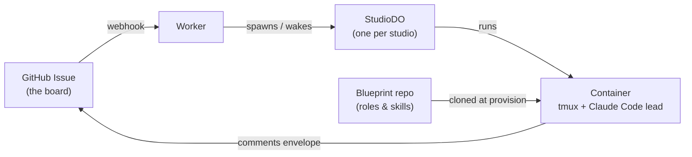

# Fleetflare


Run coding agents as long-lived cloud studios instead of processes on your
laptop. Each **studio** is a Cloudflare Container running one Claude Code
session — the **lead** — plus the member subagents it dispatches, wired to a
**GitHub Issues board**: work arrives as an issue, the studio reports back
with a comment on that same issue, and there's no separate dashboard to keep
in sync.

<!-- TODO: screenshot/GIF of a running studio here -->

**Status:** Fleetflare runs a real fleet daily across several repositories.
It is not a turnkey product — expect to read code when something surprises
you. ([full status](#status) below.)

---

## 🎯 Why this exists

- Local agents are bounded by local RAM. Measured on a 24 GB machine: 84
  worktrees, 135 node/claude processes, 7.2 GB resident, and everything
  slows down together.
- A cloud studio costs zero local memory and survives a closed laptop, a
  lost network, and a reboot.
- The tradeoff is honest: you can no longer see the work by glancing at a
  terminal. So every running studio gets a visible row and a live terminal
  (in [Orca](docs/setup.md#requirements) or plain `fleet ls`/`fleet
  attach`), and nothing spends money where you cannot see it.

## 🧩 How it fits together

| Piece | What it is |
|---|---|
| **Worker** | The brain. HTTP routes, a one-minute cron, the GitHub webhook. |
| **StudioDO** | One Durable Object per studio. Holds its token, schedules its ticks, talks to its container. |
| **Container** | Ubuntu with tmux, git, `gh`, Bun, Chrome for Testing, and the Claude Code CLI. The lead lives in tmux window 0. |
| **Board** | GitHub Issues in the *target* repo. Labels are the state machine. |
| **Blueprint** | Role definitions and skills, cloned from this repo into the container at provision time. |



A studio's id is `<repo>--<role>`, for example `acme-site--web-studio`. That
id is an address: it becomes a DNS label, a board assignment label, and the
registry key. Dots and underscores in a repo name fold to hyphens.

## 🧠 Leads never implement

A PreToolUse hook refuses a lead's `Edit`/`Write` and its file-writing Bash
forms, so implementation is dispatched to member subagents. This is enforced
in code, not asked for in a prompt.

## 🚀 Quickstart

There is one real path here: deploy your own Worker to your own Cloudflare
account. How long that takes depends on how many of the pieces below you
already have on hand — a Cloudflare account, a GitHub PAT, a Claude Code
OAuth token — not on the length of this guide.

```bash
git clone https://github.com/<you>/fleetflare
cd fleetflare/apps/fleet
bun install

export FLEET_OPS_DIR="$HOME/fleetflare-ops"   # wherever your private ops-repo-shaped checkout lives; add this to your shell profile so it survives new terminals
mkdir -p "$FLEET_OPS_DIR/fleet"
cp wrangler.example.jsonc "$FLEET_OPS_DIR/fleet/wrangler.jsonc"
```

From there you need: a Cloudflare D1 database and R2 bucket, GitHub auth (a
fine-grained PAT is the default), Cloudflare Access in front of the Worker,
and the essential secrets — `CLAUDE_CODE_OAUTH_TOKEN`,
`GITHUB_WEBHOOK_SECRET`, `ACCESS_TEAM_DOMAIN`, `ACCESS_AUD`, `GITHUB_TOKEN` —
set one at a time with `scripts/deploy.sh secret put <NAME>` (never a bare
`wrangler secret put`). Then:

```bash
bun run migrate:local    # apps/fleet/migrations/ against a local D1 for `wrangler dev`, via scripts/deploy.sh
bun run migrate:remote   # apps/fleet/migrations/ against your real D1, via scripts/deploy.sh
bun run deploy --allow-unrescued   # FIRST deploy only (see below): scripts/deploy.sh -> wrangler deploy -c wrangler.local.jsonc
bun link            # from apps/fleet — provides `fleet` and `ff`
fleet ls            # must list studios (even zero of them), not 401/403
```

Full walkthrough — every resource, every secret, Claude accounts, and why
`--allow-unrescued` is needed the first time: **[docs/setup.md](docs/setup.md)**.

## 🕹️ Daily use

From inside any repo you want a studio for:

```bash
ff                          # this repo's maestro: spawn if absent, then attach
ff web-studio "<brief>"     # file a task, spawn a studio for it, attach
ff web-studio 412           # adopt existing issue #412
```

`ctrl-]` detaches. The studio keeps running.

```bash
fleet ls                    # every studio: state, readiness, burn
fleet check <id>            # ask the container right now, read-only
fleet task ls               # the board for this repo
fleet task new --title T --objective O --output F --boundaries B
fleet provision <id>        # heal a half-built studio, same container
                            # --fresh-session (also on recycle): start claude without
                            # --continue; old session moved aside, never deleted,
                            # shipped to R2 sessions/<id>/aside/<dir>/ on its own
fleet recycle <id>          # new container on the current image; rescues first
                            # refuses if rescue impossible; --discard-unsynced overrides
fleet destroy <id>          # stop for good; rescues first; refuses if rescue impossible
                            # (--discard-unsynced or --force overrides)
```

### Roles

`maestro` coordinates and never implements. `web-studio` and `release-studio`
carry members. `pilot` and `scratch` are lightweight. A studio id is
`<repo>--<role>`, so one repo supports one studio per role — parallelism beyond
that comes from members inside each studio, which is the intended shape.

## 📚 Key concepts

| Concept | What it means |
|---|---|
| **studio** | One Cloudflare container running one Claude Code session (the lead) plus the member subagents it dispatches. |
| **lead** | The Claude Code session in a studio's tmux window 0. Never implements directly — a hook forces it to dispatch to members. |
| **maestro** | The role that coordinates a repo's work and never implements; one of the roles alongside `web-studio`, `release-studio`, `pilot`, `scratch`. |
| **board** | The GitHub Issues in your target repo. Labels are the state machine work moves through. |
| **rescue** | Before any deploy that replaces containers, `fleet rescue-all` commits and pushes every studio's uncommitted work to its own `fleet/rescue/...` branch so nothing is lost. See [docs/operations.md](docs/operations.md). |
| **junior / GLM** | The opt-in `FLEET_JUNIOR` skill: studios can delegate mechanical, low-risk edits to a Workers AI model (GLM) and review its diff before applying. See [docs/setup.md](docs/setup.md). |
| **account failover** | With `FLEET_AUTO_FAILOVER=on`, a studio that hits its Claude usage limit switches to the next configured `CLAUDE_CODE_OAUTH_TOKEN_<n>` automatically. Off by default. See [docs/setup.md](docs/setup.md). |
| **leak gate** | Always on: a studio whose work repo is public (or unconfirmed) refuses any push or `gh` write matching a private denylist. |

## 🔒 Safety features

- **Leak gate** (always on) — a studio whose work repo is public, or whose
  visibility cannot be confirmed, refuses any `git push` or `gh`
  issue/pr/api/release/gist write whose text matches a private denylist.
- **Write proxy** (opt-in, per repo) — a listed repo's studios hold a
  read-only GitHub credential; their writes are scanned against the same
  denylist and forwarded by the Worker instead.
- **No studio ever holds a Cloudflare deploy credential** — a lead asked to
  `wrangler deploy` or run a remote migration itself is expected to refuse.
- **Cloudflare Access** sits in front of the terminal endpoint (`/studio/*`),
  since it is a shell.
- **`fleet recycle` and `fleet destroy` rescue uncommitted work first** and
  refuse if the rescue is impossible (`--discard-unsynced`/`--force`
  override, loudly).

## ❓ FAQ

**Why GitHub Issues instead of a dashboard?**
Because it's the board you already use. Work reaches a studio as an issue,
and the studio reports back by commenting an envelope on that same issue —
no separate task database, no dashboard to keep in sync.

**What happens if my laptop dies mid-task?**
Nothing to the studio itself — it runs in a Cloudflare container, not on your
laptop, and keeps working through a closed laptop, a lost network, or a
reboot.

**Does this cost money when idle?**
A studio is a live container: it keeps running (and costing) until you
`fleet recycle` or `fleet destroy` it. Fleetflare's guarantee is visibility,
not idle-suspend — `fleet ls` lists every running studio and its burn, so
nothing spends money where you cannot see it.

**What stops a studio going rogue on my repo?**
The leak gate (always on) refuses any push or GitHub write matching a
private denylist when the repo is public; the write proxy (opt-in) hands a
listed repo's studios a read-only credential and routes writes through the
Worker instead; and no studio ever holds a Cloudflare deploy credential. See
[docs/threat-model.md](docs/threat-model.md).

**Can I run more than one studio per repo?**
One studio per role — a studio id is `<repo>--<role>`, so `maestro`,
`web-studio`, `release-studio`, `pilot`, and `scratch` can all run at once on
the same repo. Parallelism beyond that comes from the member subagents
inside each studio.

**Can leads implement code themselves?**
No. A PreToolUse hook refuses a lead's `Edit`/`Write` and its file-writing
Bash forms, enforced in code. Implementation is always dispatched to member
subagents.

**Does deploying lose in-progress work?**
Every deploy replaces every container, but `bun run deploy` runs `fleet
rescue-all` first and refuses to proceed if any studio's uncommitted work
cannot be rescued. See [docs/operations.md](docs/operations.md).

**Do I need Claude Code specifically, or can I use another AI coding tool?**
The studio image runs the Claude Code CLI as the lead today — this project
is not yet tool-agnostic.

## 📁 Repository layout

```
apps/fleet/          the Worker, the CLI, the container image
  src/               Worker source: routes, Durable Objects, board, GitHub
  cli/               `fleet` and `ff`
  container/         Dockerfile and bring-up for the studio image
fleet/blueprint/     role definitions and org chart the studios inherit
gates/              hooks that constrain what a lead may do
skills/             operator and agent skills
docs/               plans and design records
```

## 🛠️ Development

```bash
cd apps/fleet
bun run check       # types, all tsconfig projects
bun run test        # vitest-pool-workers
bun run bun-test    # container-level tests; needs tmux and Chromium
```

Both test lanes matter. `bun run test` alone is half the suite.

CI runs on the operator's Mac, not GitHub Actions — see
[docs/operations.md](docs/operations.md) for the local-ci daemon, lanes, and
`known-flaky.txt`.

## Status

Fleetflare runs a real fleet daily across several repositories. It is not a
turnkey product: it assumes Cloudflare, GitHub, Claude Code, and an editor that
can host terminals. Expect to read code when something surprises you — and
[docs/operations.md](docs/operations.md) tells you which surprises to expect
first.

## Security and license

Read [docs/threat-model.md](docs/threat-model.md) before deploying: a studio
runs its agent as root in a container that holds real credentials. Report
vulnerabilities privately as described in [SECURITY.md](SECURITY.md).
Contributions: [CONTRIBUTING.md](CONTRIBUTING.md).

Licensed under the Apache License, Version 2.0 — see [LICENSE](LICENSE) and
[NOTICE](NOTICE).
