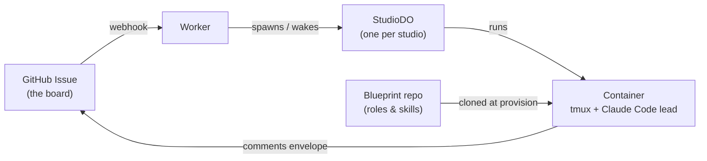

# Architecture

The concepts, the moving pieces, the safety model, and the questions people
ask first — moved out of the root [README.md](../README.md) so the front
door stays short. Nothing here is condensed from what the README used to
say; the Safety section below links to [docs/threat-model.md](threat-model.md)
instead of repeating it, since that document already covers the same ground
in depth.

## Key concepts

| Concept | What it means |
|---|---|
| **studio** | One Cloudflare container running one Claude Code session (the lead) plus the member subagents it dispatches. |
| **lead** | The Claude Code session in a studio's tmux window 0. Never implements directly — a hook forces it to dispatch to members. |
| **maestro** | The role that coordinates a repo's work and never implements; one of the roles alongside `web-studio`, `release-studio`, `pilot`, `scratch`. |
| **board** | The GitHub Issues in your target repo. Labels are the state machine work moves through. |
| **rescue** | Before any deploy that replaces containers, `fleet rescue-all` commits and pushes every studio's uncommitted work to its own `fleet/rescue/...` branch so nothing is lost. See [docs/operations.md](operations.md). |
| **junior / GLM** | The opt-in `FLEET_JUNIOR` skill: studios can delegate mechanical, low-risk edits to a Workers AI model (GLM) and review its diff before applying. See [docs/setup.md](setup.md). |
| **account failover** | With `FLEET_AUTO_FAILOVER=on`, a studio that hits its Claude usage limit switches to the next configured `CLAUDE_CODE_OAUTH_TOKEN_<n>` automatically. Off by default. See [docs/setup.md](setup.md). |
| **leak gate** | Always on: a studio whose work repo is public (or unconfirmed) refuses any push or `gh` write matching a private denylist. |

## How it works

| Piece | What it is |
|---|---|
| **Worker** | The brain. HTTP routes, a one-minute cron, the GitHub webhook. |
| **StudioDO** | One Durable Object per studio. Holds its token, schedules its ticks, talks to its container. |
| **Container** | Ubuntu with tmux, git, `gh`, Bun, Chrome for Testing, and the Claude Code CLI. The lead lives in tmux window 0. |
| **Board** | GitHub Issues in the *target* repo. Labels are the state machine. |
| **Blueprint** | Role definitions and skills, cloned from this repo into the container at provision time. |



A studio's id is `<repo>--<role>`, for example `acme-site--web-studio`. That
id is an address: it becomes a DNS label, a board assignment label, and the
registry key. Dots and underscores in a repo name fold to hyphens.

### Roles

`maestro` coordinates and never implements. `web-studio` and `release-studio`
carry members. `pilot` and `scratch` are lightweight. A studio id is
`<repo>--<role>`, so one repo supports one studio per role — parallelism beyond
that comes from members inside each studio, which is the intended shape.

## Safety

- 🔓 **Leak gate** (always on) — a studio whose work repo is public, or whose
  visibility cannot be confirmed, refuses any `git push` or `gh`
  issue/pr/api/release/gist write whose text matches a private denylist.
- 🔁 **Write proxy** (opt-in, per repo) — a listed repo's studios hold a
  read-only GitHub credential; their writes are scanned against the same
  denylist and forwarded by the Worker instead.
- 🔑 **No studio ever holds a Cloudflare deploy credential** — a lead asked to
  `wrangler deploy` or run a remote migration itself is expected to refuse.
- 🚪 **Cloudflare Access** sits in front of the terminal endpoint (`/studio/*`),
  since it is a shell.
- 💾 **`fleet recycle` and `fleet destroy` rescue uncommitted work first** and
  refuse if the rescue is impossible (`--discard-unsynced`/`--force`
  override, loudly).

Read [docs/threat-model.md](threat-model.md) before deploying: a studio runs
its agent as root in a container that holds real credentials — that document
covers what it holds, where each credential lives, and what risks are
accepted by design. Report vulnerabilities privately as described in
[SECURITY.md](../SECURITY.md).

## FAQ

**Why GitHub Issues instead of a dashboard?**
Because it's the board you already use. Work reaches a studio as an issue,
and the studio reports back by commenting an envelope on that same issue —
no separate task database, no dashboard to keep in sync.

**What happens if my laptop dies mid-task?**
Nothing to the studio itself — it runs in a Cloudflare container, not on your
laptop, and keeps working through a closed laptop, a lost network, or a
reboot.

**Does this cost money when idle?**
A studio is a live container: it keeps running (and costing) until you
`fleet recycle` or `fleet destroy` it. Fleetflare's guarantee is visibility,
not idle-suspend — `fleet ls` lists every running studio and its burn, so
nothing spends money where you cannot see it.

**What stops a studio going rogue on my repo?**
The leak gate (always on) refuses any push or GitHub write matching a
private denylist when the repo is public; the write proxy (opt-in) hands a
listed repo's studios a read-only credential and routes writes through the
Worker instead; and no studio ever holds a Cloudflare deploy credential. See
[docs/threat-model.md](threat-model.md).

**Can I run more than one studio per repo?**
One studio per role — a studio id is `<repo>--<role>`, so `maestro`,
`web-studio`, `release-studio`, `pilot`, and `scratch` can all run at once on
the same repo. Parallelism beyond that comes from the member subagents
inside each studio.

**Can leads implement code themselves?**
No. A PreToolUse hook refuses a lead's `Edit`/`Write` and its file-writing
Bash forms, enforced in code. Implementation is always dispatched to member
subagents.

**Does deploying lose in-progress work?**
`bun run deploy` runs `fleet rescue-all` first and refuses to proceed if any
studio's uncommitted work cannot be rescued. Since container images build
reproducibly, a deploy that only touches Worker source keeps the same image
digest and leaves running studios untouched; a deploy that changes
`container/` replaces the containers built from it, which is exactly what
the rescue gate protects. See [docs/operations.md](operations.md).

**Do I need Claude Code specifically, or can I use another AI coding tool?**
The studio image runs the Claude Code CLI as the lead today — this project
is not yet tool-agnostic.

## Repository layout

```
apps/fleet/          the Worker, the CLI, the container image
  src/               Worker source: routes, Durable Objects, board, GitHub
  cli/               `fleet` and `ff`
  container/         Dockerfile and bring-up for the studio image
fleet/blueprint/     role definitions and org chart the studios inherit
gates/              hooks that constrain what a lead may do
skills/             operator and agent skills
docs/               plans and design records
```
