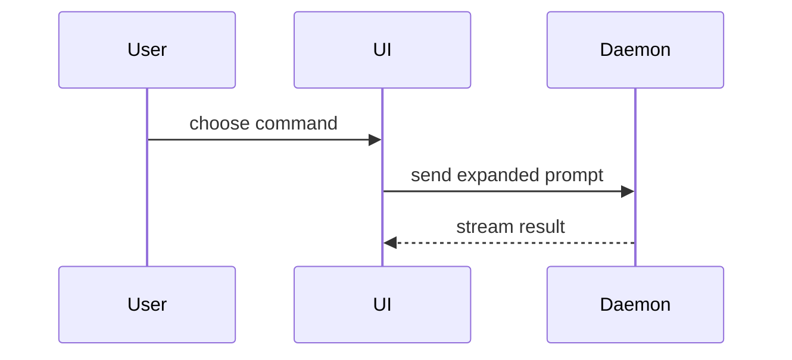

<!--
Vendored from https://github.com/mattpocock/skills (commit b0618bc436ad),
MIT License. Source: skills/engineering/pr/SKILL.md.
Only change from upstream: the `name:` frontmatter field above, renamed from
`pr` to `pr-body` to match this repo's skill directory. The `metadata.credits`
block is Pocock's own attribution to his upstream source (show-me, Dex
Horthy/Humanlayer) and is preserved unchanged -- not this repo's credit to
add or remove. Body below is otherwise unchanged. See skills/VENDORED.md and
skills/THIRD-PARTY-LICENSES.md. The "Fleetflare addendum" section at the end
of this file is NOT vendored -- it's this repo's own addition, clearly
marked.
-->

Use this template for writing the PR body:

```markdown
## Summary

<diagram, diff-sketch, or tree>

## Evidence

- **Before:** <screenshot/output/failing test run>
  **After:** <screenshot/output/passing test run>

## Merge Danger

**Door:** <one-way or two-way>

<optional: description>

**Blast Radius:** <one-word description>

<optional: potential ramifications of merge>
```

## Sections

Skip all preambles and keep prose brief. Use the user's domain language from `GLOSSARY.md`.

### Summary

Pick the smallest view that makes the key point clear.

- Show logic or an algorithm as pseudocode:

```text
on(save)
  if content is unchanged
    return cached result
  write new content
  return fresh result
```

- Show runtime control flow as a call tree:

```text
submitForm
  createSession
    persistPrompt
    launchAgent
  navigateToSession
```

- Show UI structure as a component tree, including state and module boundaries that matter:

```text
<SessionPage> (apps/example/src/routes/session.tsx)
  useSessionEvents()
  <SessionToolbar>
    <RunSkillButton> (packages/ui)
```

- Show file responsibility or a broad refactor as a shallow file tree:

```text
src/
├── commands/       # parses user actions
├── sessions/       # owns session state
└── transport/      # sends API requests
```

- Show component interaction, control flow, or data flow with Mermaid:



- Use `diff` when the point is what changes and the surrounding shape already exists. Match the diff shape to the topic.

For a component change:

```diff
 <SessionPage>
   useSessionEvents()
   <SessionToolbar>
+    <RunSkillButton />
   <SessionTimeline>
+    <SkillResultCard />
```

For a file-layout change:

```diff
 src/
 ├── commands/
+│   └── show-me.ts       # expands the slash command
 ├── sessions/
-└── transport.ts
+└── transport/
+    ├── client.ts
+    └── stream.ts
```

For a call-tree or call-stack change:

```diff
 submitForm
   createSession
     persistPrompt
+    expandSkillMention
     launchAgent
-  navigateToSession
+  navigateToSession
+    subscribeToEvents
```

For a state or control-flow change:

```diff
 on(save)
-  write content
+  if content is unchanged
+    return cached result
+  write new content
+  invalidate cache
```

- Show the whole block when most of it is new, when omitted context would hide ownership or order, or when the user needs a copyable target shape:

```ts
function expandSkill(command: string): string {
  const skillName = command.slice(1);
  return `use the ${skillName} skill`;
}
```

#### Guidance

Place each visual next to the short text it supports. Keep only the calls, files, props, states, and boundaries needed to answer the user's current question or the options to resolve the current discussion point.

You may use one of these, you may use several, it is unlikely you will use all of them. Use your judgement and don't overwhelm the user.

### Evidence

Concrete evidence that the change works. Show a before and after.

Screenshots are S-tier - when the environment is set up for it and the change is visual.

Execution-based evidence is A-tier. Test results, console output. Show the exact test that now fails and passes, using pseudocode.

### Merge Danger

Describe whether it's a one-way or two-way door. You can walk back through two-way doors, but not one-way doors. A PR that is cheap to roll back is lower risk. Changes that involve destructive actions or hard-to-reverse decisions are one-way doors.

The blast radius is the potential impact or scope of the changes introduced by this PR. Consider all possibilities. Examples are layout shift, breakages for consumers, mobile responsiveness, etc.

---

## Fleetflare addendum (not vendored -- this repo's own)

Everything above this line is Matt Pocock's `pr` skill, vendored verbatim
(only the frontmatter `name:` changed; the `metadata.credits` block is his
own, preserved). Everything below is fleetflare's own addition.

### One source of truth: merge with the existing web-studio template

This repo's `.github/pull_request_template.md` already uses this exact
three-section shape -- confirmed by diff against the vendored template
above:

```
## Summary

## Evidence

## Merge Danger

- **Door:** one-way | two-way
- **Blast Radius:**
```

Same three headings, same Door/Blast-Radius sub-fields under Merge Danger.
The only difference is formatting (this repo's template renders Door and
Blast Radius as a bullet list; the vendored template above renders them as
bold-label freeform lines) -- not a different shape. That similarity is not
a coincidence: this repo's template was itself written with this same
Summary/Evidence/Merge-Danger shape in mind before this skill was vendored.

This skill is now the canonical documentation of that one shared template,
not a second, competing definition. If this skill and
`.github/pull_request_template.md` ever look like they disagree, the
template wins (it's the file GitHub actually renders into every new PR) --
open an issue, don't silently pick one.

Reach for this skill on every PR, not only when asked to review PR quality
-- it's model-invoked, the same way `superpowers:requesting-code-review` is
expected to read `skills/deep-modules/SKILL.md`'s checklist on every review.

### Filling Merge Danger honestly, in this repo

- **Door** -- `one-way` or `two-way`. See
  `fleet/blueprint/studios/web-studio/studio.md`'s own classification rule:
  a path-based classifier (`apps/fleet/scripts/merge-danger.ts`'s
  `ONE_WAY_GLOBS`) is a FLOOR, never a ceiling -- it can force `one-way`,
  but your own judgment can call a PR one-way even when no path matches.
  Never let the classifier downgrade your own one-way call to two-way.
- **Blast Radius** -- one line: what breaks, and for whom, if this change is
  wrong. Name the actual blast, not the intent behind the change -- "fixes
  the login bug" is not a blast radius; "every login attempt fails closed
  if the token check regresses" is.

See `skills/deep-modules/SKILL.md` for the companion maintainability
checklist a reviewer applies to the diff itself, separate from how the PR
body describes it.
